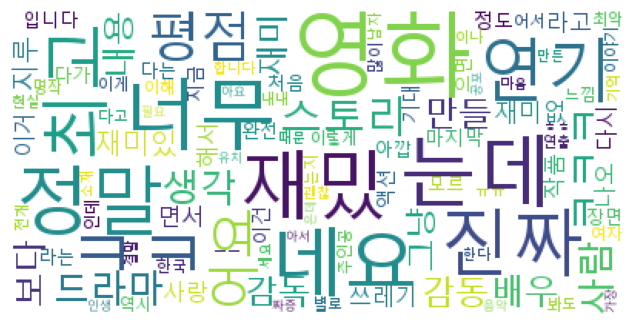
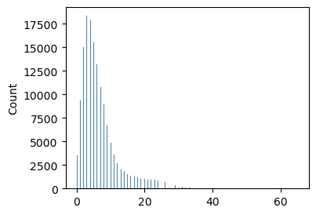

네이버 영화 리뷰 데이터인 NSMC데이터를 사용해서 NLP를 연습해 보겠습니다.

초보자의 입장에서 사용한 코드이므로 참고하시길 바랍니다.

감사합니다.


```python
import re
from konlpy.tag import Mecab 
import pandas as pd
import numpy as np
import matplotlib.pyplot as plt
import seaborn as sns
```


```python
import sys
sys.version
```


    '3.8.8 (default, Apr 13 2021, 15:08:03) [MSC v.1916 64 bit (AMD64)]'


파이썬 3.8버젼을 이용해서 작성하였습니다. 윈도우 사용자들은 구글링을 하셔서 메캡 설치 방법을 찾아서 다운로드 받으시면 됩니다.

# 데이터 불러오기
- 영화리뷰 데이터인 NSMC 데이터를 사용해보겠습니다


```python
rating_train = pd.read_csv('./nsmc-master/nsmc-master/ratings_train.txt', sep = "\t",  engine='python', encoding = "utf-8")
rating_test = pd.read_csv('./nsmc-master/nsmc-master/ratings_test.txt', sep = "\t",  engine='python', encoding = "utf-8")
```


```python
rating_train.head()
```


<div>
<style scoped>
    .dataframe tbody tr th:only-of-type {
        vertical-align: middle;
    }

    .dataframe tbody tr th {
        vertical-align: top;
    }
    
    .dataframe thead th {
        text-align: right;
    }
</style>
<table border="1" class="dataframe">
  <thead>
    <tr style="text-align: right;">
      <th></th>
      <th>id</th>
      <th>document</th>
      <th>label</th>
    </tr>
  </thead>
  <tbody>
    <tr>
      <th>0</th>
      <td>9976970</td>
      <td>아 더빙.. 진짜 짜증나네요 목소리</td>
      <td>0</td>
    </tr>
    <tr>
      <th>1</th>
      <td>3819312</td>
      <td>흠...포스터보고 초딩영화줄....오버연기조차 가볍지 않구나</td>
      <td>1</td>
    </tr>
    <tr>
      <th>2</th>
      <td>10265843</td>
      <td>너무재밓었다그래서보는것을추천한다</td>
      <td>0</td>
    </tr>
    <tr>
      <th>3</th>
      <td>9045019</td>
      <td>교도소 이야기구먼 ..솔직히 재미는 없다..평점 조정</td>
      <td>0</td>
    </tr>
    <tr>
      <th>4</th>
      <td>6483659</td>
      <td>사이몬페그의 익살스런 연기가 돋보였던 영화!스파이더맨에서 늙어보이기만 했던 커스틴 ...</td>
      <td>1</td>
    </tr>
  </tbody>
</table>
</div>


```python
print(len(rating_train))
print(len(rating_test))
```

    150000
    50000


총 20만개의 데이터가 있음을 확인할 수 있다.

# 전처리
- 부호 제거, 토큰화, 불용어 제거


```python
rating_test['document'].astype('str')
```


    0                                 []
    2    ['평점', '나쁘', '짜리', '더더욱', '잖아']
    3           ['지루', '은데', '완전', '막장']
    4    ['어도', '텐데', '나와서', '심기', '불편']
    5           ['음악', '최고', '음악', '영화']
    Name: document, dtype: object


```python
#특수문자 및 영어 없애기

def del_special(text):
    text = re.sub("[^ㄱ-ㅎㅏ-ㅣ가-힣 ]", "", text) #한글을 제외한 모든 건 삭제
    return text

rating_train['document'] = rating_train['document'].astype('str').apply(del_special)
rating_test['document'] = rating_test['document'].astype('str').apply(del_special)
```


```python
# 결측치 제거

rating_train = rating_train[rating_train['document'].str.len() >= 1]
rating_test = rating_test[rating_test['document'].str.len() >= 1]
```


```python
%%time
# 토큰화 및 불용어(stopwords) 제거

# mecab 객체 생성
mecab = Mecab(dicpath=r"C:\mecab\mecab-ko-dic")
SW = list(pd.read_csv('./stopwords-ko.txt',header=None).iloc[:,0])

def token_and_stopwords(text):
    return [word for word in mecab.morphs(text) if word not in SW and len(word) > 1]

rating_train['document'] = rating_train['document'].apply(token_and_stopwords)
rating_test['document'] = rating_test['document'].apply(token_and_stopwords)
```

    Wall time: 57.3 s


전처리를 끝낸 후의 데이터 확인


```python
rating_train.tail()
```


<div>
<style scoped>
    .dataframe tbody tr th:only-of-type {
        vertical-align: middle;
    }

    .dataframe tbody tr th {
        vertical-align: top;
    }
    
    .dataframe thead th {
        text-align: right;
    }
</style>
<table border="1" class="dataframe">
  <thead>
    <tr style="text-align: right;">
      <th></th>
      <th>id</th>
      <th>document</th>
      <th>label</th>
    </tr>
  </thead>
  <tbody>
    <tr>
      <th>149995</th>
      <td>6222902</td>
      <td>[인간, 문제지, 인가]</td>
      <td>0</td>
    </tr>
    <tr>
      <th>149996</th>
      <td>8549745</td>
      <td>[평점, 너무, 아서]</td>
      <td>1</td>
    </tr>
    <tr>
      <th>149997</th>
      <td>9311800</td>
      <td>[이게, 한국인, 거들먹거리, 필리핀, 혼혈, 착하]</td>
      <td>0</td>
    </tr>
    <tr>
      <th>149998</th>
      <td>2376369</td>
      <td>[청춘, 영화, 최고봉, 방황, 우울, 자화상]</td>
      <td>1</td>
    </tr>
    <tr>
      <th>149999</th>
      <td>9619869</td>
      <td>[한국, 영화, 최초, 수간, 내용, 담긴, 영화]</td>
      <td>0</td>
    </tr>
  </tbody>
</table>
</div>


### nltk 라이브러리를 활용해서 전처리 한 정보 집계하기


```python
import nltk
text = nltk.Text([word for text in rating_train['document'] for word in text])
text.vocab().most_common(10)
```


    [('영화', 57601),
     ('는데', 11464),
     ('너무', 11013),
     ('정말', 9779),
     ('재밌', 8988),
     ('네요', 8979),
     ('진짜', 8327),
     ('ㅋㅋ', 7233),
     ('연기', 6826),
     ('최고', 6579)]


# Wordcloud


```python
from wordcloud import WordCloud

data = text.vocab().most_common(100)

wordcloud = WordCloud(font_path='C:/Windows/Fonts/malgun.ttf', # font_path : 윈도우는 .ttf, macOS는 .otf
                      relative_scaling = 0.2,
                      max_font_size=60,
                      background_color='white',
                      ).generate_from_frequencies(dict(data))
plt.figure(figsize=(12,4))
plt.imshow(wordcloud)
plt.axis("off")
plt.show()
```



    


# SVM을 이용한 예측


```python
from sklearn.feature_extraction.text import CountVectorizer
from sklearn.feature_extraction.text import TfidfVectorizer
from sklearn.pipeline import Pipeline
from sklearn.svm import SVC
```


```python
rating_train.head()
```


<div>
<style scoped>
    .dataframe tbody tr th:only-of-type {
        vertical-align: middle;
    }

    .dataframe tbody tr th {
        vertical-align: top;
    }
    
    .dataframe thead th {
        text-align: right;
    }
</style>
<table border="1" class="dataframe">
  <thead>
    <tr style="text-align: right;">
      <th></th>
      <th>id</th>
      <th>document</th>
      <th>label</th>
    </tr>
  </thead>
  <tbody>
    <tr>
      <th>0</th>
      <td>9976970</td>
      <td>[진짜, 짜증, 네요, 목소리]</td>
      <td>0</td>
    </tr>
    <tr>
      <th>1</th>
      <td>3819312</td>
      <td>[포스터, 보고, 초딩, 영화, 오버, 연기, 가볍, 구나]</td>
      <td>1</td>
    </tr>
    <tr>
      <th>2</th>
      <td>10265843</td>
      <td>[너무, 밓었다그래서보는것을추천한다]</td>
      <td>0</td>
    </tr>
    <tr>
      <th>3</th>
      <td>9045019</td>
      <td>[교도소, 이야기, 구먼, 솔직히, 재미, 평점, 조정]</td>
      <td>0</td>
    </tr>
    <tr>
      <th>4</th>
      <td>6483659</td>
      <td>[사이몬페그, 익살, 스런, 연기, 돋보였, 영화, 스파이더맨, 보이, 커스틴, 던...</td>
      <td>1</td>
    </tr>
  </tbody>
</table>
</div>


```python
def list_to_str(text): 
    return " ".join(text)
```


```python
# 데이터 구성

train_x = [list_to_str(text) for text in rating_train['document']]
train_y = np.array(rating_train['label'])
test_x = [list_to_str(text) for text in rating_test['document']]
test_y = np.array(rating_test['label'])

# 모델 파이프라인 구축
model1 = Pipeline([
    ('vect' , CountVectorizer()), #Bag of Word
    ('clf' , SVC())
])

model2 = Pipeline([
    ('vect' , TfidfVectorizer()), #TF-IDF
    ('clf' , SVC())
])
```


```python
print(len(train_x))
print(len(train_y))
```

    149186
    149186


컴퓨터가 너무 안 좋아서 안 돌아가는 관계로 ㅜㅜ 앞부분 10000개만 학습시켜 보겠습니다.


```python
train_x_sample = train_x[:10000]
train_y_sample = train_y[:10000]
test_x_sample = test_x[:5000]
test_y_sample = test_y[:5000]
```


```python
%%time
model1.fit(train_x_sample, train_y_sample)
model2.fit(train_x_sample, train_y_sample)
```

    Wall time: 19.6 s


    Pipeline(steps=[('vect', TfidfVectorizer()), ('clf', SVC())])


```python
print(f"countervectorizer + SVM : {model1.score(test_x_sample,test_y_sample)}")
print(f"TF-IDF vectorizer + SVM : {model2.score(test_x_sample,test_y_sample)}")
```

    countervectorizer + SVM : 0.7726
    TF-IDF vectorizer + SVM : 0.7844


대략 70 후반대의 정확도를 보여줍니다. 데이터를 더 학습시키면 좋아질 것으로 예상됩니다.


```python
pred = model1.predict(test_x_sample)
```

결과 확인

- 1 : 긍정
- 0 : 부정


```python
 pd.DataFrame({"text":test_x_sample[10:20], "pred":pred[10:20]})
```


<div>
<style scoped>
    .dataframe tbody tr th:only-of-type {
        vertical-align: middle;
    }

    .dataframe tbody tr th {
        vertical-align: top;
    }
    
    .dataframe thead th {
        text-align: right;
    }
</style>
<table border="1" class="dataframe">
  <thead>
    <tr style="text-align: right;">
      <th></th>
      <th>text</th>
      <th>pred</th>
    </tr>
  </thead>
  <tbody>
    <tr>
      <th>0</th>
      <td>한국 독립영화 한계 그렇게 아버지 된다 비교</td>
      <td>0</td>
    </tr>
    <tr>
      <th>1</th>
      <td>청춘 아름답 아름다움 이성 흔들 는다 찰나 아름다움 포착 섬세 아름다운 수채화 퀴어 영화</td>
      <td>1</td>
    </tr>
    <tr>
      <th>2</th>
      <td>보이 반전 영화 흡인력 사라지</td>
      <td>0</td>
    </tr>
    <tr>
      <th>3</th>
      <td>스토리 연출 연기 비주얼 영화 기본 영화 영화 김문옥 감독 영화 경력 인데 조무래기...</td>
      <td>0</td>
    </tr>
    <tr>
      <th>4</th>
      <td>소위 문가 라는 평점</td>
      <td>0</td>
    </tr>
    <tr>
      <th>5</th>
      <td>최고</td>
      <td>1</td>
    </tr>
    <tr>
      <th>6</th>
      <td>발연기 도저히 진짜 이렇게 연기 라곤 상상 못했</td>
      <td>0</td>
    </tr>
    <tr>
      <th>7</th>
      <td>나이스</td>
      <td>0</td>
    </tr>
    <tr>
      <th>8</th>
      <td>재미 우려먹 챔프 방송 더라 ㅋㅋㅋ ㅋㅋㅋ ㅋㅋㅋ ㅋㅋ</td>
      <td>0</td>
    </tr>
    <tr>
      <th>9</th>
      <td>금요일 나이트메어 시리즈 가장 시리즈 양산 해냈 레이저 시리즈 작가 상상력 돋보이 ...</td>
      <td>1</td>
    </tr>
  </tbody>
</table>
</div>


# LSTM을 이용한 예측

### 토큰화 및 정수 인코딩


```python
text = nltk.Text([word for text in rating_train['document'] for word in text])
pd.Series(text.tokens).value_counts()
```


    영화      57601
    는데      11464
    너무      11013
    정말       9779
    재밌       8988
            ...  
    초면          1
    부네          1
    스무고개        1
    잡힙니다        1
    겁대가리        1
    Length: 47803, dtype: int64


```python
sum(pd.Series(text.tokens).value_counts() >=2)
```


    26827


총 47803개의 토큰들 중 전체 문서중에서 최소 2번 이상 등장하는 토큰은 약 27000개 정도. 이것을 단어 집합의 크기로 정하자


```python
import tensorflow as tf
from tensorflow.keras.preprocessing.text import Tokenizer

# Keras가 인식할 수 있도록 토큰화
tokenizer = Tokenizer(num_words=27000)
tokenizer.fit_on_texts(train_x)

# LSTM의 input으로 넣기 위해 변환
x_train = tokenizer.texts_to_sequences(train_x)
x_test = tokenizer.texts_to_sequences(test_x)
#train_y는 그대로
#test_y는 그대로
print(x_train[0:2])
```

    [[7, 94, 6, 405], [267, 273, 369, 1, 1046, 9, 581, 190]]


이런식으로 토큰화 및 정수 인코딩을 실행한 것을 확인할 수 있습니다.

### 패딩
- 리뷰 데이터에서 길이가 30 이하인 데이터가 전체의 99.7%로 대부분을 차지함 그러므로 최대 길이는 30으로 정하겠습니다.
- ex) [30, 22, 123, 444]라는 리뷰 데이터의 길이 : 4


```python
sum([len(txt) <= 30 for txt in x_train]) / len(x_train)
```


    0.9968696794605392


```python
plt.figure(figsize=(4,3))
sns.histplot([len(txt) for txt in x_train])
plt.show()
```


​    

​    


```python
# 리뷰 데이터의 크기를 맞춰주기 위한 zero padding
from tensorflow.keras.preprocessing.sequence import pad_sequences

x_train = pad_sequences(x_train, value=0, padding='pre', maxlen=30)
x_test = pad_sequences(x_test, value=0, padding='pre', maxlen=30)
print(x_train[0])
```

    [  0   0   0   0   0   0   0   0   0   0   0   0   0   0   0   0   0   0
       0   0   0   0   0   0   0   0   7  94   6 405]


최종적으로 인코딩 및 패딩을 완료한 데이터의 모습입니다.


```python
# 학습 가능한 형태로 최종 변환.
train_ds = tf.data.Dataset.from_tensor_slices((x_train, train_y)).shuffle(10000).batch(64)
test_ds = tf.data.Dataset.from_tensor_slices((x_test, test_y)).batch(64)
```

### 모델 만들어서 예측하기


```python
from tensorflow.keras.layers import Embedding, Dense, LSTM
from tensorflow.keras.models import Sequential

model = Sequential()
model.add(Embedding(input_dim=27000, #Size of the vocabulary
                    output_dim=100)) #Dimension of the dense embedding.
model.add(LSTM(units=128, #dimensionality of the output space
               dropout=0.2, #overfitting 방지
               recurrent_dropout=0.2))
model.add(Dense(1, activation='sigmoid'))
```

노트북이 안 좋은 관계로 epoch는 5번만 해보겠습니다.


```python
%%time
# 모델 컴파일
model.compile(optimizer='adam', loss='binary_crossentropy', metrics=['accuracy'])

# Early Stopping Callback(val_loss가 계속 올라가면 stop)
ES = tf.keras.callbacks.EarlyStopping(monitor="val_loss", patience=10, verbose=1)

history = model.fit(train_ds, validation_data=test_ds, epochs=5, callbacks=[ES])
```

    Epoch 1/3
    2332/2332 [==============================] - 305s 129ms/step - loss: 0.4221 - accuracy: 0.7978 - val_loss: 0.3952 - val_accuracy: 0.8113
    Epoch 2/3
    2332/2332 [==============================] - 303s 130ms/step - loss: 0.3459 - accuracy: 0.8422 - val_loss: 0.4168 - val_accuracy: 0.8145
    Epoch 3/3
    2332/2332 [==============================] - 298s 128ms/step - loss: 0.2976 - accuracy: 0.8659 - val_loss: 0.4467 - val_accuracy: 0.8054


### 모델 평가


```python
score, acc = model.evaluate(x_test,test_y, batch_size=64)
```

    777/777 [==============================] - 12s 16ms/step - loss: 0.4467 - accuracy: 0.8054


LSTM을 활용하면 0.8정도의 퍼포먼스를 보여주고 있습니다.

### 모델 저장


```python
model.save_weights("nsmc_lstm")
```
